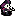
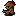
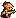
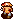
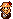
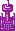
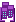

**Hello! Vesper/ShinyDeagle Here!**  
This is a Github Demo Project I setup to show you how to create your own Custom Armies!  
Many of you might have multiple armies that you might want to switch between so I thought this was the best solution for you guys.  

You'll need to create your own Github Repo with folders for each custom army you want  
  
This is an example of what your folder hierachy should look like.  
  
- main
  - My-Custom-Army | A Folder with all the assets of a custom army.
    - gs_xxinfantry.gif
    - xxinfantry.gif
    - xxinfantry_mdown.gif
    - xxinfantry_mside.gif
    - xxinfantry_mup.gif
    - xxmech.gif
    - xxtank.gif
    - xxcity.gif
    - xxport.gif
    - xxairport.gif
    - xxcomtower.gif
    - xxbase.gif
    - etc...
  
Each unit has 5 sprites that are used on the website...  
Building Sprites can just have a single format for them.  
**tealgalaxycity.gif** -> **xxcity.gif**  
These will be needed when the extension does the replacement otherwise you might get some assets _flickering_  
  
The Same Process must be repeated for each unit you want to replace the asset with.  
Make sure to have the **xx** prefix before the unit so that the extension can handle the replacements for you.  
You don't need to have every asset present but missing assets like xxinfantry_mside will make the website default to the country you were replacing. 
  
A Default Idle - Its Normal Animation  
EG: xxinfantry.gif | osinfantry.gif  

  
A Grayscale Version Of Its Idle. Usually when the unit is done with an Action.  
EG: gs_xxinfantry.gif | gs_osinfantry.gif  

Three Movement Assets. One for Up, Down, Side.  
**SIDE ANIMATIONS MUST FACE TO THE RIGHT, THE WEBSITE HANDLES FLIPS BASED ON COUNTRY.**  
EG: xxinfantry_mside.gif | osinfantry_mside.gif  
EG: xxinfantry_mup.gif | osinfantry_mside.gif  
EG: xxinfantry_mdown.gif | osinfantry_mside.gif  
  
  
  
  
**Custom Buildings are now supported!**  

  
Just add the sprite as a xxcity.gif, xxport.gif, xxhq.gif and so on.  
All buildings have 3 frames with the lights on Frame 1 and Frame 3.  
Frame 1: 30ms Delay  
Frame 2: 40ms Delay  
Frame 3: 90ms Delay  
  
The FINAL step is to obtain the RAW link to the github folder.  
The extension needs the raw link so that it can pull the sprites from Github.  
The raw link is the most realiable way to quickly get sprite info from a Github Repo without being rate-limited but it can be a bit finicky.  
An example raw-link for this army would look like this.  
**https://raw.githubusercontent.com/ShinyDeagle/My-Custom-Army/refs/heads/main/ab-rework/**  

To get your raw link, navigate to any of your images in the folder you saved it.  
  
  
Right-Click Directly At The Image and Open the Image in a new Tab.  
  

Copy the part just before the name of the file. INCLUDING THE **/** AT THE END  
Here is an example of what you should grab!  
**https://raw.githubusercontent.com/ShinyDeagle/My-Custom-Army/refs/heads/main/ab-rework/**  

Once you are done with all that. You can now paste that link into the extension!  
  

You can do the same for any other custom army you want to import. Whether it be Yours or a Friends!  
Anyway, That's all you need. Enjoy!  
